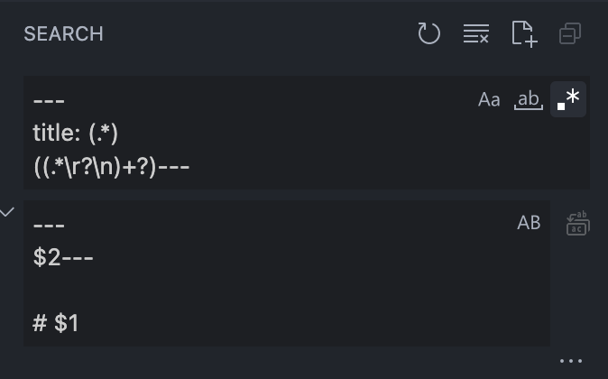

# Transform Docusaurus Frontmatter

Today i wanted to move all the `title: ` fields from the frontmatter to the markdown content (since docusaurus knows how to do this...). 

**Old**:

```md
---
title: Transform Docusaurus Frontmatter
tags: [docusaurus]
image: ./images/search-and-replace.png
---

Today i wanted to move all the...
```

**New**:


```md
---
tags: [docusaurus]
image: ./images/search-and-replace.png
---

# Transform Docusaurus Frontmatter

Today i wanted to move all the...
```

Since i had a lot of files to transform, i wanted to use "Search & Replace". I came up with the following Search Pattern in VS-Code:




```
---
title: (.*)
((.*\r?\n)+?)---
```

```
---
$2---

# $1
```

## Add new field to existing `sidebar_custom_props`

Search:
```
---
((.*\r?\n)+?)?sidebar_custom_props:
(  .+\r?\n)+?((.*\r?\n)+?)?---
```

Replace:
```
---
$1sidebar_custom_props:
$3  foo: bar
$4---
```
