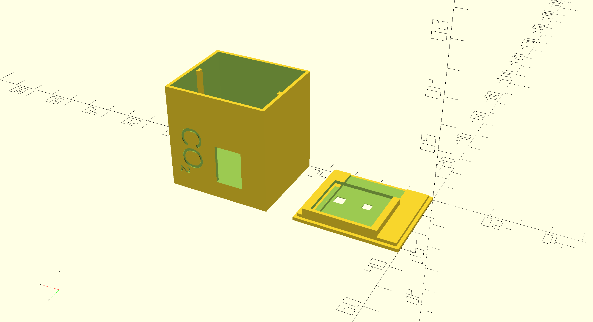

# ESP8266 Box for CO2 Sensor



- [Wemos D1 Mini Micro ESP8266](https://de.aliexpress.com/item/32651747570.html)
- [ENS160 + AHT21 Sensor](https://de.aliexpress.com/item/1005004052950350.html)
- [OLED 0.66 Zoll 64x48](https://de.aliexpress.com/item/1005004070162561.html)

A little Sensorbox, which can be used host a Wemos D1 Mini, connected to an eCO2 sensor and a little OLED Screen.


```openscad reference
https://github.com/lebalz/blog/blob/main/docs/OpenSCAD/ESP8266-CO2-Box/box.scad
```
