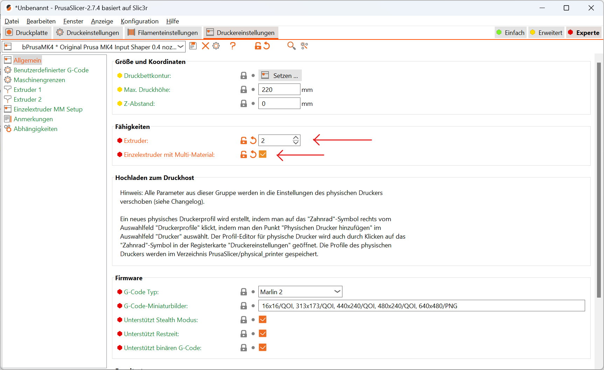
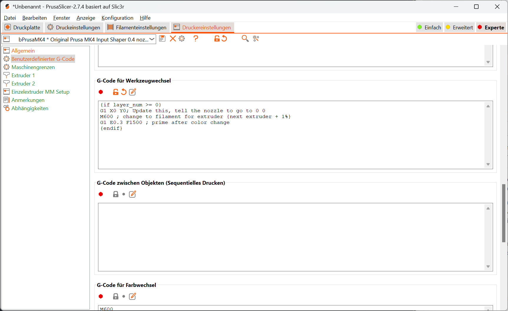
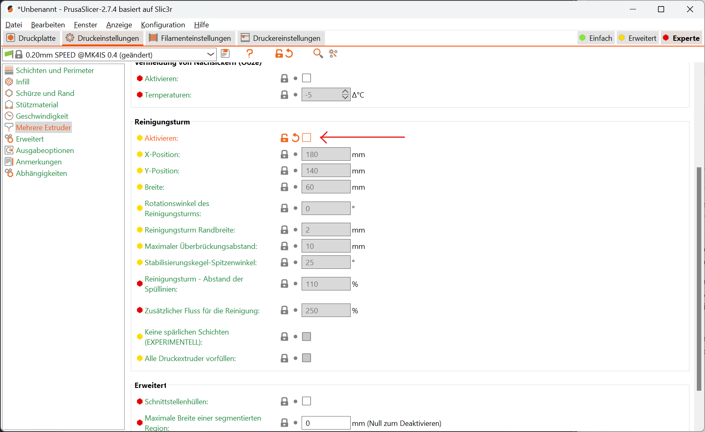

# Prusa Slicer

prusa specific gcodes
: [👉 help.prusa3d.com](https://help.prusa3d.com/article/prusa-firmware-specific-g-code-commands_112173)
custom gcode placeholders
: [👉 help.prusa3d.com](https://help.prusa3d.com/article/list-of-placeholders_205643)

## Manual Multi Material





```gcode
{if layer_num >= 0}
G1 X0 Y0 Z{toolchange_z+10} E-0.6 F700; Update this, tell the nozzle to go to 0 0 tool height
M600 ; change to filament for extruder
G1 Z0.2 ; go to bed level
G1 E0.3 F1500 ; prime after color change
G1 X0 Y0 Z{toolchange_z+10}; ensure to not crash any printed objects after priming
{endif}
```

Advanced settings with color prompt from [mike_gka@forum.prusa3d.com](https://forum.prusa3d.com/forum/postid/673676/)

```gcode
; eliminate first tool change
{if previous_extruder != -1}
G0 Z{toolchange_z+10} F6000
M601 ; Pause
M400 ; wait until all moves are completed
; color notification
M117 Next color is { (extruder_colour[next_extruder] == "#00FF00" ? "GREEN"
:(extruder_colour[next_extruder] == "#FF0000" ? "RED"
:(extruder_colour[next_extruder] == "#FFFF00" ? "YELLOW"
:(extruder_colour[next_extruder] == "#0000FF" ? "BLUE"
:(extruder_colour[next_extruder] == "#FFFFFF" ? "WHITE"
:(extruder_colour[next_extruder] == "#000000" ? "BLACK"
:(extruder_colour[next_extruder] == "#999999" ? "GRAY"
:(extruder_colour[next_extruder] == "#D4AF37" ? "GOLD"
:(extruder_colour[next_extruder] == "#C0C0C0" ? "SILVER"
:(extruder_colour[next_extruder] == "#FF8000" ? "ORANGE"
:(extruder_colour[next_extruder] == "#800080" ? "PURPLE"
:(extruder_colour[next_extruder] == "#FF6600" ? "ORANGE"
:(extruder_colour[next_extruder] == "#F0F0F0" ? "TRANSPARENT"
:(extruder_colour[next_extruder] == "#800000" ? "BROWN"
:extruder_colour[next_extruder] ))))))))))))))};
G4 S4 ; wait 4 seconds
M600
{endif}
```


