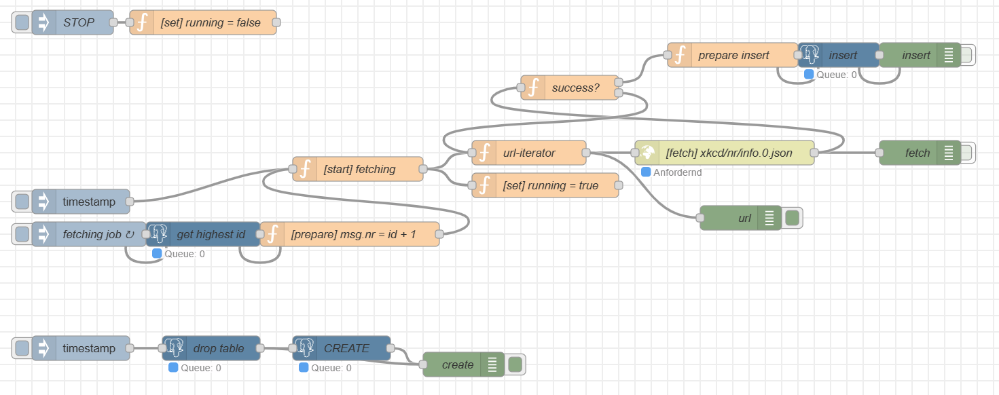

# XKCD


[👉 xkcd.com](https://xkcd.com/)

## Setup XKCD Database

```sql
drop table if exists comics;
CREATE TABLE comics (
    id int primary key,
    title text,
    transcript text,
    alt text,
    image text,
    url text,
    day int,
    month int,
    year int,
    news text,
    created_at timestamp default current_timestamp
);
```

## Fetch Data over Node RED



<details>
<summary>Node Red Flow</summary>

```json
[{"id":"fc4e087054a24e6a","type":"tab","label":"XKCD->DB","disabled":false,"info":"","env":[]},{"id":"4c8c5dbbac46d99c","type":"inject","z":"fc4e087054a24e6a","name":"","props":[{"p":"payload"},{"p":"nr","v":"1","vt":"num"}],"repeat":"","crontab":"","once":false,"onceDelay":0.1,"topic":"","payload":"","payloadType":"date","x":100,"y":380,"wires":[["fda3bf74b62b9e32"]]},{"id":"b0014c410f1624c8","type":"function","z":"fc4e087054a24e6a","name":"url-iterator","func":"const url = `https://xkcd.com/${msg.nr}/info.0.json`\nmsg.url = url;\nreturn msg;","outputs":1,"timeout":0,"noerr":0,"initialize":"// Der Code hier wird ausgeführt,\n// wenn der Node gestartet wird\nflow.set('nr', 1);","finalize":"","libs":[],"x":650,"y":320,"wires":[["ed582669b570ee36","d56c2712a6d22d66"]]},{"id":"ed582669b570ee36","type":"http request","z":"fc4e087054a24e6a","name":"[fetch] xkcd/nr/info.0.json","method":"GET","ret":"obj","paytoqs":"ignore","url":"","tls":"","persist":false,"proxy":"","insecureHTTPParser":false,"authType":"","senderr":false,"headers":[],"x":890,"y":320,"wires":[["a7d1ed8eaacd3d01","708297e526990f18","53840aa28f324e27"]]},{"id":"a7d1ed8eaacd3d01","type":"debug","z":"fc4e087054a24e6a","name":"fetch","active":false,"tosidebar":true,"console":false,"tostatus":false,"complete":"true","targetType":"full","statusVal":"","statusType":"auto","x":1130,"y":320,"wires":[]},{"id":"708297e526990f18","type":"function","z":"fc4e087054a24e6a","name":"success?","func":"if (!flow.get('running')) {\n    return [null, null];\n}\nmsg.nr = msg.nr + 1;\nif (msg.statusCode === 200) {\n    flow.set('err404count', 0);\n    return [msg, msg];\n}\nconst errCount = flow.get('err404count');\nif (errCount > 20) {\n    flow.set('err404count', 0);\n    return [null, null];\n}\n\nflow.set('err404count', errCount + 1);\n// do not try to insert\nreturn [null, msg];","outputs":2,"timeout":0,"noerr":0,"initialize":"// Der Code hier wird ausgeführt,\n// wenn der Node gestartet wird\nflow.set('err404count', 0);","finalize":"","libs":[],"x":700,"y":240,"wires":[["114f12db71dc1ebd"],["b0014c410f1624c8"]]},{"id":"8f8e39e5060aea83","type":"inject","z":"fc4e087054a24e6a","name":"STOP","props":[{"p":"payload"},{"p":"topic","vt":"str"}],"repeat":"","crontab":"","once":false,"onceDelay":0.1,"topic":"","payload":"","payloadType":"date","x":90,"y":160,"wires":[["169d46f774b89fcf"]]},{"id":"169d46f774b89fcf","type":"function","z":"fc4e087054a24e6a","name":"[set] running = false","func":"flow.set('running', false);\nreturn msg;","outputs":1,"timeout":0,"noerr":0,"initialize":"","finalize":"","libs":[],"x":250,"y":160,"wires":[[]]},{"id":"f9c127a947771c47","type":"function","z":"fc4e087054a24e6a","name":"[set] running = true","func":"flow.set('running', true);\nreturn msg;","outputs":1,"timeout":0,"noerr":0,"initialize":"","finalize":"","libs":[],"x":670,"y":360,"wires":[[]]},{"id":"bbe898a0878e2cab","type":"postgresql","z":"fc4e087054a24e6a","name":"CREATE","query":"CREATE TABLE comics (\n    id int primary key,\n    title text,\n    transcript text,\n    alt text,\n    image text,\n    url text,\n    day int,\n    month int,\n    year int,\n    news text,\n    created_at timestamp default current_timestamp\n);","postgreSQLConfig":"1f94a9b7c3a701e3","split":false,"rowsPerMsg":1,"outputs":1,"x":420,"y":560,"wires":[["481221af9ec7c043"]]},{"id":"e221a970a2cd904a","type":"postgresql","z":"fc4e087054a24e6a","name":"insert","query":"insert into comics (\n    id,\n    title,\n    transcript,\n    alt,\n    image,\n    url,\n    day,\n    month,\n    year,\n    news\n) values (\n    $id,\n    $title,\n    $transcript,\n    $alt,\n    $image,\n    $url,\n    $day,\n    $month,\n    $year,\n    $news\n) returning *;","postgreSQLConfig":"1f94a9b7c3a701e3","split":false,"rowsPerMsg":1,"outputs":1,"x":1030,"y":200,"wires":[["e69414d7a68207e5"]]},{"id":"de5f2bf591b6f604","type":"postgresql","z":"fc4e087054a24e6a","name":"drop table","query":"drop table if exists comics;","postgreSQLConfig":"1f94a9b7c3a701e3","split":false,"rowsPerMsg":1,"outputs":1,"x":260,"y":560,"wires":[["bbe898a0878e2cab","481221af9ec7c043"]]},{"id":"6373181ea178eb68","type":"inject","z":"fc4e087054a24e6a","name":"","props":[{"p":"payload"},{"p":"topic","vt":"str"}],"repeat":"","crontab":"","once":false,"onceDelay":0.1,"topic":"","payload":"","payloadType":"date","x":100,"y":560,"wires":[["de5f2bf591b6f604"]]},{"id":"481221af9ec7c043","type":"debug","z":"fc4e087054a24e6a","name":"create","active":true,"tosidebar":true,"console":false,"tostatus":false,"complete":"payload","targetType":"msg","statusVal":"","statusType":"auto","x":570,"y":580,"wires":[]},{"id":"114f12db71dc1ebd","type":"function","z":"fc4e087054a24e6a","name":"prepare insert","func":"msg.queryParameters = {\n    ...msg.payload,\n    url: msg.url.replace('/info.0.json', '/'),\n    id: msg.payload.num,\n    title: msg.payload.safe_title,\n    image: msg.payload.img\n}\nreturn msg;","outputs":1,"timeout":0,"noerr":0,"initialize":"","finalize":"","libs":[],"x":900,"y":200,"wires":[["e221a970a2cd904a"]]},{"id":"e69414d7a68207e5","type":"debug","z":"fc4e087054a24e6a","name":"insert","active":false,"tosidebar":true,"console":false,"tostatus":false,"complete":"payload","targetType":"msg","statusVal":"","statusType":"auto","x":1130,"y":200,"wires":[]},{"id":"8717b7426063d5fd","type":"inject","z":"fc4e087054a24e6a","name":"fetching job","props":[{"p":"payload"},{"p":"topic","vt":"str"}],"repeat":"3600","crontab":"","once":false,"onceDelay":0.1,"topic":"","payload":"","payloadType":"date","x":110,"y":420,"wires":[["8c8473a7f8b86e59"]]},{"id":"8c8473a7f8b86e59","type":"postgresql","z":"fc4e087054a24e6a","name":"get highest id","query":"select max(id) from comics;","postgreSQLConfig":"1f94a9b7c3a701e3","split":false,"rowsPerMsg":1,"outputs":1,"x":250,"y":420,"wires":[["1b04e668306de725"]]},{"id":"fda3bf74b62b9e32","type":"function","z":"fc4e087054a24e6a","name":"[start] fetching","func":"if (!msg.nr) {\n    return [null];\n}\nreturn msg;","outputs":1,"timeout":0,"noerr":0,"initialize":"","finalize":"","libs":[],"x":440,"y":340,"wires":[["b0014c410f1624c8","f9c127a947771c47"]],"inputLabels":["message with msg.nr"]},{"id":"1b04e668306de725","type":"function","z":"fc4e087054a24e6a","name":"[prepare] msg.nr = id + 1","func":"msg.nr = msg.payload.length > 0 ? msg.payload[0].max + 1 : 1;\nmsg.payload = {}\nreturn msg;","outputs":1,"timeout":0,"noerr":0,"initialize":"","finalize":"","libs":[],"x":430,"y":420,"wires":[["fda3bf74b62b9e32"]]},{"id":"d56c2712a6d22d66","type":"debug","z":"fc4e087054a24e6a","name":"url","active":true,"tosidebar":true,"console":false,"tostatus":false,"complete":"url","targetType":"msg","statusVal":"","statusType":"auto","x":910,"y":400,"wires":[]},{"id":"53840aa28f324e27","type":"debug","z":"fc4e087054a24e6a","name":"debug 51","active":true,"tosidebar":true,"console":false,"tostatus":false,"complete":"true","targetType":"full","statusVal":"","statusType":"auto","x":1100,"y":360,"wires":[]}]
```

</details>

