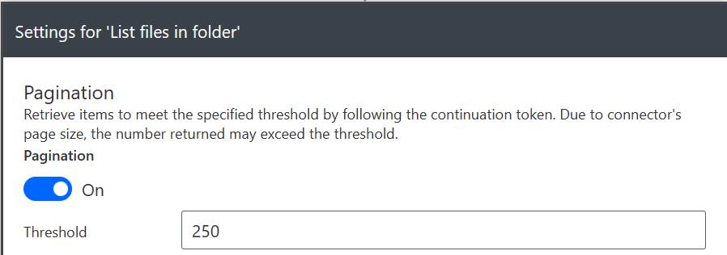

# Send JSON-Files per Mail

Important Note: OneDrive will list by default only `20` Files - to list more files, you have to set a custom threshold in `List Files In Folder > Settings > Pagination`:

