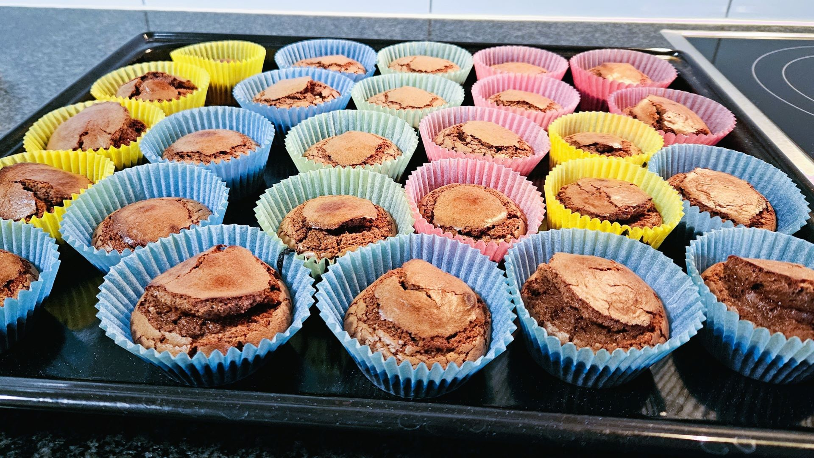

# Schoggi Muffins

::::cards{.recipe}

:::flex{.step alignItems=center}
    200 g
    : schwarze Schoggi

    150 g
    : Butter

::br
    Schmelzen
:::
:::flex{.step alignItems=center}
    4 x
    : Eigelb

    200 g
    : Zucker
::br
    schaumig rühren
:::

:::flex{.step alignItems=center}
    100 g
    : Mehl
::br
    beigeben + geschmolzene Masse auch
:::

:::flex{.step alignItems=center}
    4 x
    : Eiweiss
::br
    steif schlagen + zum Rest
:::

Papierförmli bis zur Hälfte füllen (ca. 24 Stück) im vorgeheizten Ofen bei 220°C **8-9 min.** backen.
::::