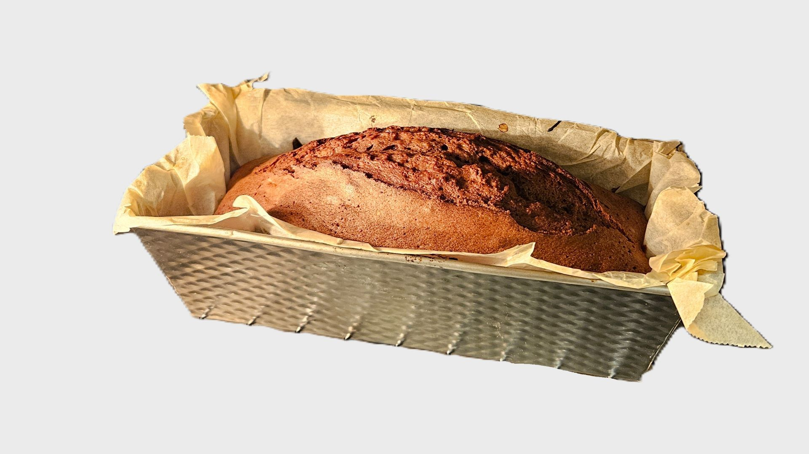

# Schoggistängeli-Chueche

::::cards{.recipe}

:::flex{.step alignItems=center}
    40 g
    : Caotina\*
    150 g
    : Weissmehl
    160 g
    : Zucker
    1 Pack
    : Vanillezucker
    1 KL
    : Backpulver
    1 Prise
    : Salz
::br
    in einer Schüssel mischen.
:::
\* *Caotina Braun, es geht auch mit Kakaopulver.*

:::flex{.step alignItems=center}
    3 x
    : Eier
    125 g
    : Butter
    3 EL
    : Milch
    2 EL
    : Kirsch
::br
    beigeben und gut mischen.
:::

:::flex{.task}
- 2/3 des Teiges in die vorbereitete Form geben.
- min. 6 Schoggistängeli darauf legen.
- Restlichen Teig darüber verteilen.
:::

:::flex{.task}
    Backen
    : 180°C, 40-45 Minuten in der unteren Hälfte des Ofens.
:::

::::